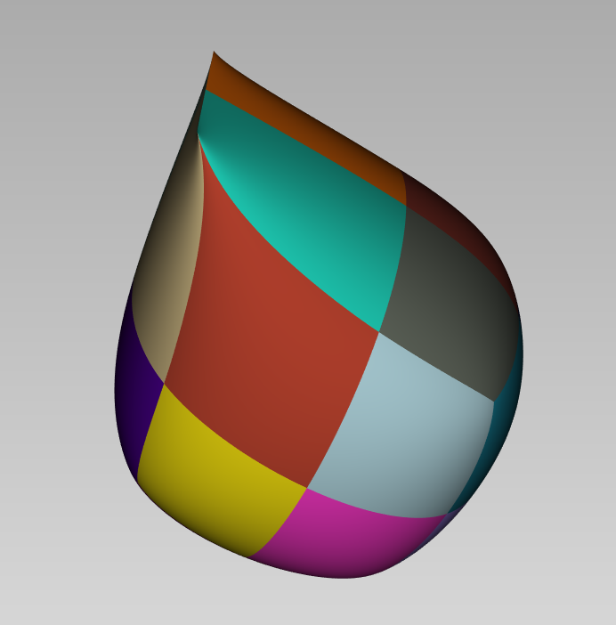

# Readers, writers, converters
```@index
Pages = ["converters.md"]
```

```@docs
set_boundary!
```
Here is an example of how to set an edge as boundary and visualize it with 'Axl':
```
  using GSplines, SemiAlgebraicTypes, Axl
  
  hm = hmesh(offdata("cube.off")) # read the mesh and convert it in half edge structure
  set_boundary!(hm, [1 2])        # define the edge with indicized vertices [1 15] as boundary
  s1 = g1surface(hm)              # create the G1 surface on the modifies half mesh
  @axlview s1                     # view the surface using Axl
```



```@docs 
bspline
```

```@docs 
offread
offdata
```


```@docs 
axldata
```
