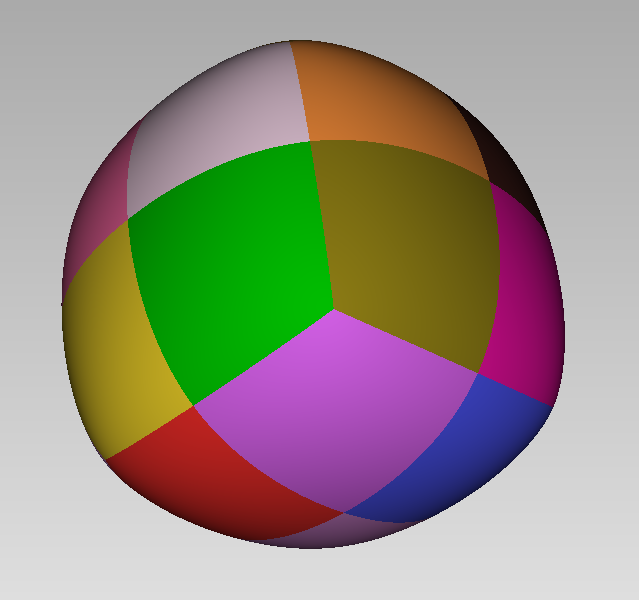

# GSplines

The package provide tools for the construction and use of Geometrically Smooth (G1) Splines .


Here is an example of construction of a G1 surface, visualized with 'Axl':
```
using GSplines, Axl
m = offdata("cube.off")
gs = g1surface(m)
@axlview gs
```


