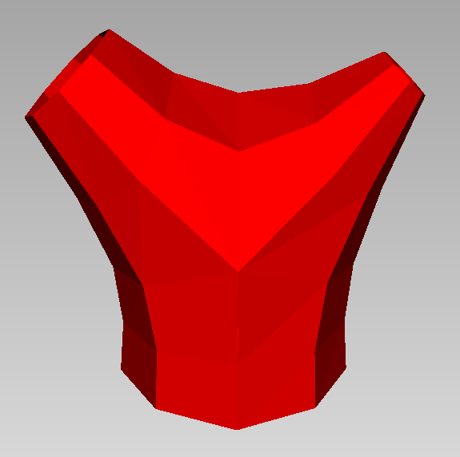
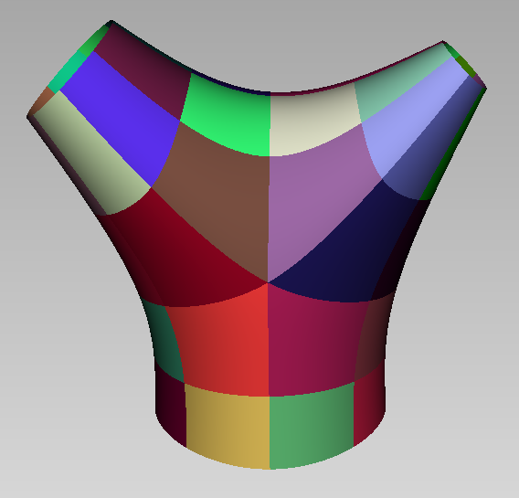
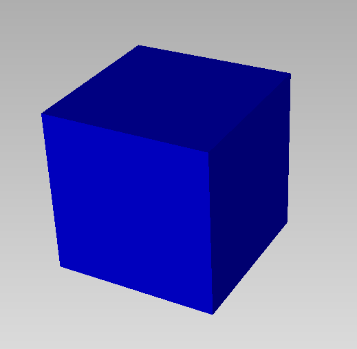

# GSplines

The package provide tools for the construction and use of Geometrically Smooth (G1) Splines .


Here is an example of construction of a G1 surface, visualized with 'Axl':
```
using GSplines, SemiAlgebraicTypes, Axl

m = axldata("y1m1.axl")[1]  #read mesh from data file "y1m1.axl"
m[:color] = Axl.red
@axlview m
```



```
s = g1surface(m)
@axlview s
```




Here is another example with an off file.
```
m1 = offdata("cube.off")
m1[:color]= Axl.blue
@axlview m1
```



```
s1 = g1surface(m1)
@axlview s1
```


Notice that the mesh has been subdivided using one step of Catmull-Clark subdivision, so that no extraordinary vertices (of valence $\neq$ 4) are connected by an edge.
